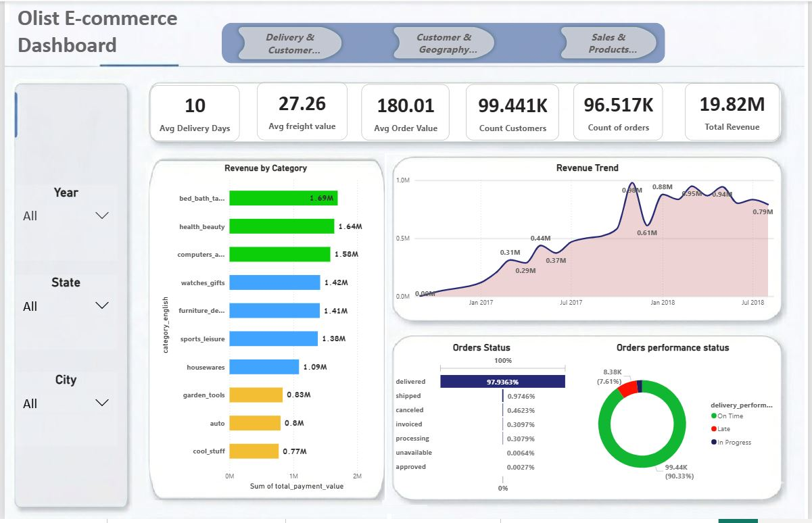
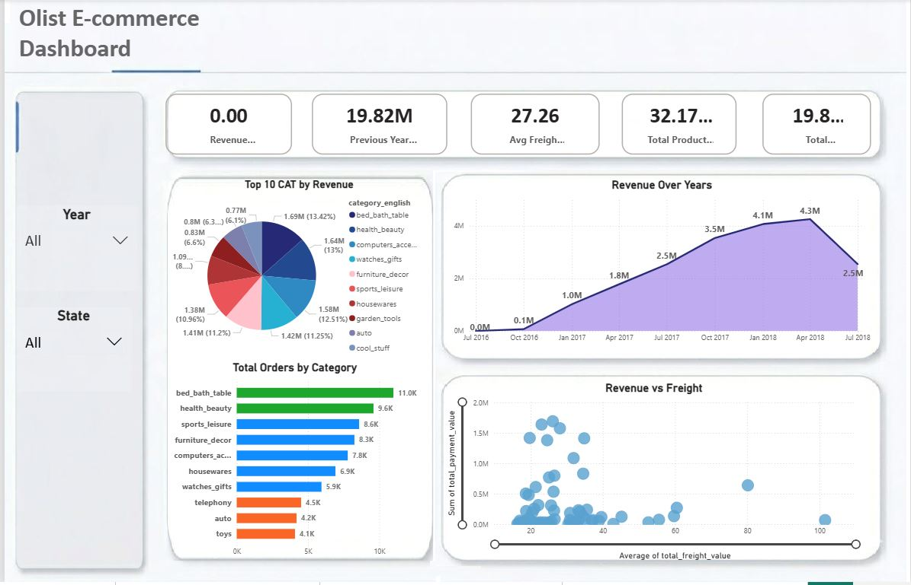
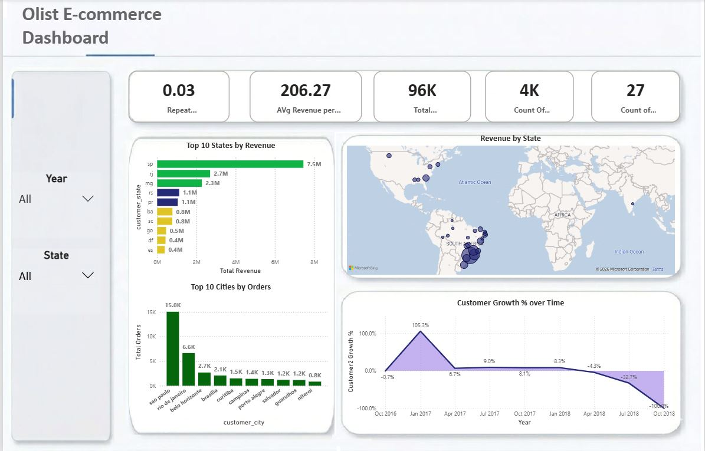
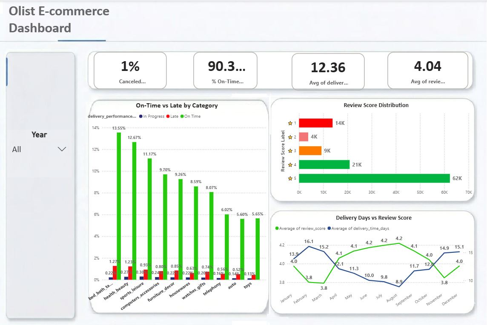

# Retail_Analysis_DWH
Retail Analytics ETL Pipeline Project Adapted for the Olist Brazilian E-Commerce

# 🛒 Retail Analytics Data Warehouse (ETL Pipeline)

## 📌 Project Overview
This project implements a complete **End-to-End ETL Pipeline & Data Warehouse** for retail analytics using the **Olist Brazilian E-Commerce dataset**.

The pipeline extracts raw data from CSV files, transforms it using ETL processes, and loads it into a **SQL Server Data Warehouse** designed using a **Star Schema**, making it ready for analytics and reporting.

---

## 🎯 Objectives
- Build a scalable ETL pipeline
- Apply **Medallion Architecture (Bronze, Silver, Gold)**
- Design a **Star Schema**
- Enable Business Intelligence reporting
- Ensure high data quality and consistency

---

## 📊 Dataset
The project is based on the Olist dataset which includes:
- Orders
- Order Items
- Customers
- Payments
- Reviews
- Products
- Sellers
- Geolocation
- Category Translation

---

# 🏗️ Architecture Overview

## 🟤 Bronze Layer (Raw Data)
Raw data ingestion with no transformation.


### 📂 Bronze Tables


---

## ⚪ Silver Layer (Clean & Transformed Data)
- Data cleaning
- Handling nulls
- Standardization
- Data integration across tables


### 📂 Silver Tables


---

## 🟡 Gold Layer (Analytical Data - Star Schema)
- Aggregated data
- Fact & Dimension tables
- Optimized for analytics


### 📂 Gold Tables


---

# ⭐ Data Warehouse Design

## 🔸 Database Schema


## 🔸 Star Schema Model


---

# 🔄 ETL Process
1. Extract CSV files  
2. Load into SQL Server staging (Bronze)  
3. Transform into Silver layer  
4. Build Gold layer (Star Schema)  
5. Connect to Power BI  

---

# ⚙️ Technologies Used
- SQL Server
- SSIS (ETL)
- SQL
- Power BI
- Python (optional)
- GitHub

---

# ✅ Key Concepts Implemented
- ✔ Incremental Load  
- ✔ Surrogate Keys  
- ✔ Slowly Changing Dimensions (SCD Type 2)  
- ✔ Data Cleaning & Transformation  
- ✔ Data Quality Validation  

---

# 📊 Power BI Dashboard

## 📄 Dashboard Pages





---

# 🚀 How to Run

### 1. Clone the repository
```bash
git clone https://github.com/Shima2Salah/Retail_Analysis_DWH.git


